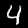
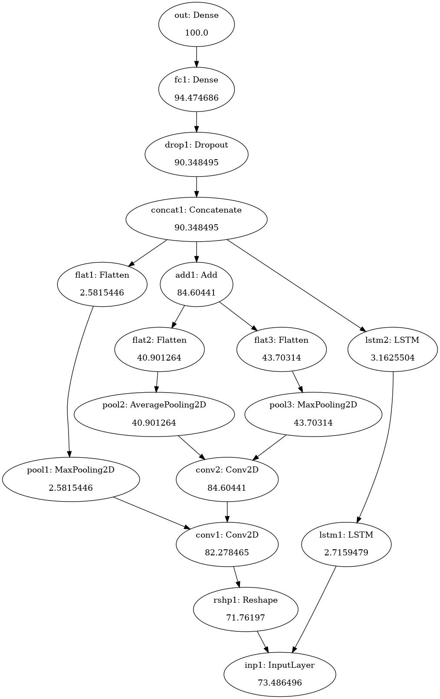
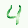

<!-- # IMPLEMENTING ARYA-xAI IMAGE CLASSIFICATION ON MNIST DATA -->

# MNIST DATA (INPUT)

We have used the MNIST character recognition dataset to demonstrate the Arya-xAI framework. The MNIST dataset of handwritten single digits between 0 and 9, consists of 60,000 small, square grayscale images with resolution 28×28pixels. A custom architecture, which contains most of the commonly used components such as convolutions and lstms, is designed for this data.

	
	
	
	

	
	
	

# NEURAL NETWORK USED 

 INPUT NETWORK ARCHITECTURE 

	

				

 OUTPUT NETWORK ARCHITECTURE from Arya-xAI

	

				
# OUTPUT

## Default Mode

	
	
	
	

	
	
	

## Contrastive Mode

 

 	
 	
 	
 	
 	
	
 
 

	
	
	
	

	
	
	
	

(Reference : BLUE - negative contrast , GREEN - positive contrast)

